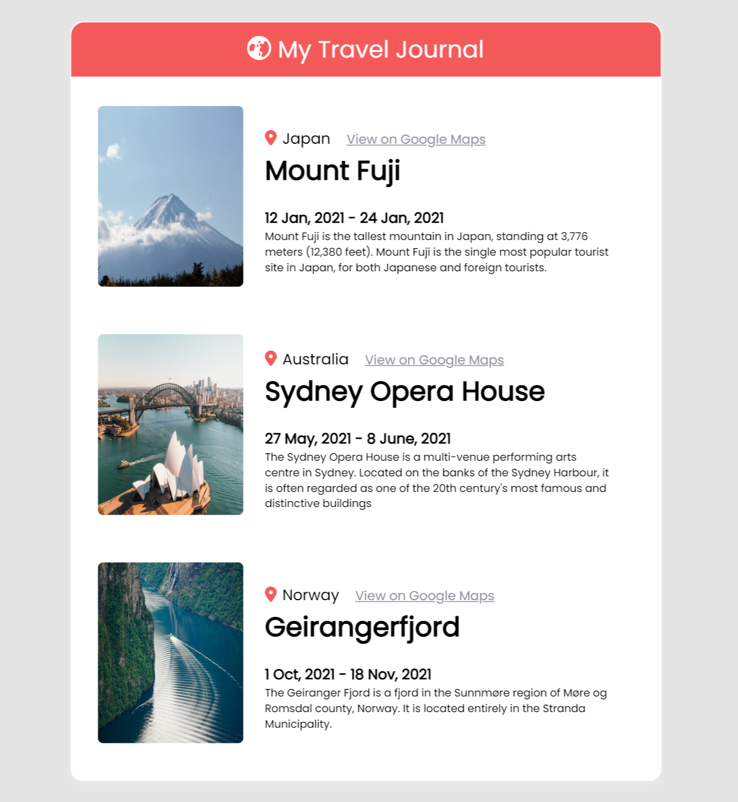

# Travel Journal

This is a practice React app made with .map and props.

The site is live [here](https://travel-journal-asmit.netlify.app/).

To add new entry, just modify `src/data.js` file. 

## Getting Started with Create React App

This project was bootstrapped with [Create React App](https://github.com/facebook/create-react-app).

### `npm start`

Runs the app in the development mode.\
Open [http://localhost:3000](http://localhost:3000) to view it in your browser.

The page will reload when you make changes.